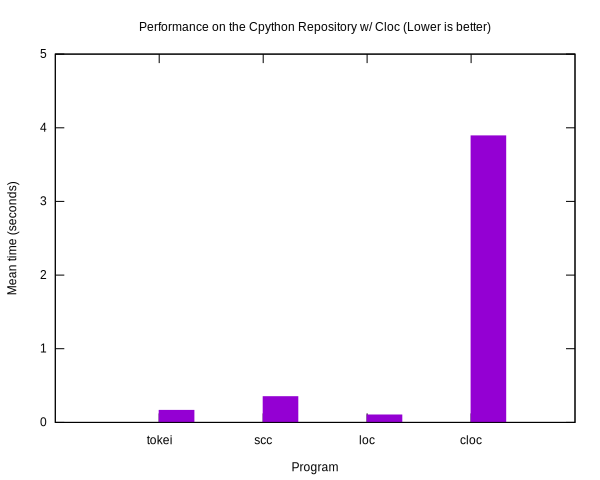
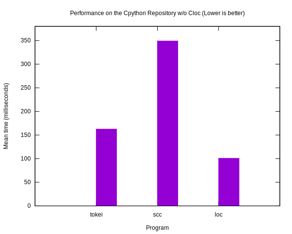
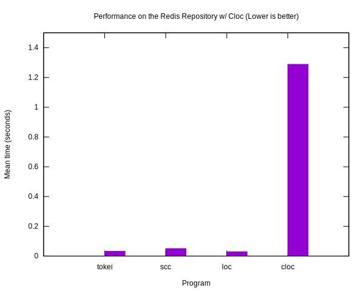
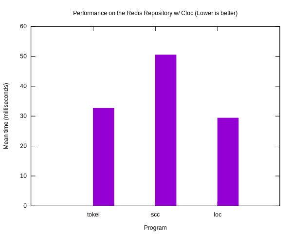
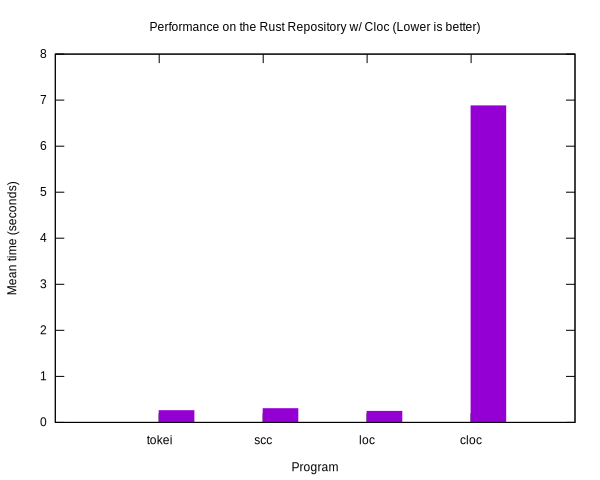
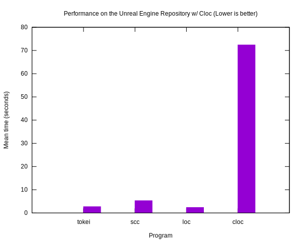
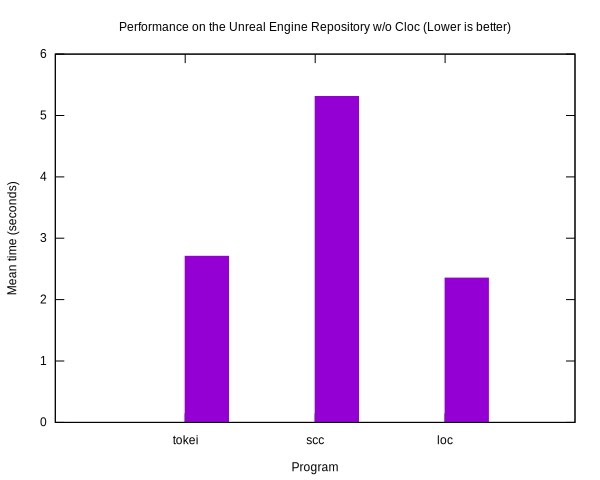

# Comparing code counters
This document is a compilation of various benchmarks and comparisons between
code counters, namely `tokei`, `cloc`, `scc`, and `loc`. This document seeks to
compare performance, and accuracy of the code counters. `polyglot` is not
currently included as it was unabled to be installed on the machine at the time
of writing.

## Preamble
All performance and accuracy comparisons were done on a 15-inch MacBook Pro,
with a 2.7GHz Intel Core i7 processor and 16GB 2133 MHz LPDDR3 RAM running macOS
High Sierra 10.13.6. All benchmarks were done using [hyperfine].

* Tokei Version: 8.0.0
* Cloc Version: 1.76
* Loc Version: 0.4.1
* Scc Version: 1.7.0

## Performance
Performance benchmarks were performed against four large open source
repositories; [Unreal Engine 4][Unreal](Hidden behind free signup), [Rust],
[CPython], and [Redis]. For clarity two versions of graphs are presented as
cloc's speeds are exponentially higher than the others so they presented with
and without cloc.

#### Repository Versions
| Repository | Commit hash |
|:---|---:|
| CPython | 3738fadc670274ecc4649f51b52a93602820a375 |
| Redis | 39c70e728b5af0c50989ffbc05e568099f3e081b |
| Rust | 727eabd68143e968d8826ee29b8ea7792d29fa96 |
| Unreal Engine 4 | 8696faa54bf2f89ca50d34e6fb3dcc461a810185 |

#### Performance on the CPython Repository
| Command | Mean [ms] | Min…Max [ms] |
|:---|---:|---:|
| `tokei` | 162.6 ± 6.1 | 157.0…184.8 |
| `scc` | 349.0 ± 6.9 | 341.9…365.4 |
| `loc` | 100.8 ± 6.1 | 93.5…119.0 |
| `cloc` | 3889.4 ± 327.6 | 3769.4…4820.8 |




#### Performance on the Redis Repository
| Command | Mean [ms] | Min…Max [ms] |
|:---|---:|---:|
| `tokei` | 32.7 ± 1.4 | 30.0…36.2 |
| `scc` | 50.5 ± 1.3 | 48.3…53.3 |
| `loc` | 29.4 ± 5.0 | 23.3…45.9 |
| `cloc` | 1288.4 ± 6.3 | 1276.1…1296.5 |




#### Performance on the Rust Repository
| Program | Mean [ms] | Min…Max [ms] |
|:---|---:|---:|
| `tokei` | 257.3 ± 8.1 | 244.3…270.2 |
| `scc` | 316.9 ± 13.8 | 302.2…345.7 |
| `loc` | 246.4 ± 11.2 | 222.7…263.1 |
| `cloc` | 6864.0 ± 57.4 | 6805.3…6996.4 |




#### Performance on the Unreal Engine Repository
| Command | Mean [ms] | Min…Max [ms] |
|:---|---:|---:|
| `tokei` | 2705.3 ± 105.8 | 2584.4…2874.6 |
| `scc` | 5308.6 ± 238.5 | 5036.4…5655.3 |
| `loc` | 2350.0 ± 152.9 | 2208.1…2687.9 |
| `cloc` | 72389.9 ± 12385.2 | 58032.0…97798.6 |




## Accuracy
It's important for a code counter to not just be faster, but to be accurate.
Below is a small Rust file with a lot of edge cases taken from Tokei's test
suite. The first line is the human expected number of lines, comments, code, and
blanks. Using this as a sample of a code counters sample, we'll display a table
of the reported number of lines in the four repositories mentioned above.

#### Test case
```rust
// 39 lines 32 code 2 comments 5 blanks

/* /**/ */
fn main() {
    let start = "/*";
    loop {
        if x.len() >= 2 && x[0] == '*' && x[1] == '/' { // found the */
            break;
        }
    }
}

fn foo() {
    let this_ends = "a \"test/*.";
    call1();
    call2();
    let this_does_not = /* a /* nested */ comment " */
        "*/another /*test
            call3();
            */";
}

fn foobar() {
    let does_not_start = // "
        "until here,
        test/*
        test"; // a quote: "
    let also_doesnt_start = /* " */
        "until here,
        test,*/
        test"; // another quote: "
}

fn foo() {
    let a = 4; // /*
    let b = 5;
    let c = 6; // */
}
```

###### Tokei
```
-------------------------------------------------------------------------------
 Language            Files        Lines         Code     Comments       Blanks
-------------------------------------------------------------------------------
 Rust                    1           39           32            2            5
-------------------------------------------------------------------------------
```

###### Scc
```
-------------------------------------------------------------------------------
Language                 Files     Lines     Code  Comments   Blanks Complexity
-------------------------------------------------------------------------------
Rust                         1        34       28         1        5          5
-------------------------------------------------------------------------------
```

###### Loc
```
--------------------------------------------------------------------------------
 Language             Files        Lines        Blank      Comment         Code
--------------------------------------------------------------------------------
 Rust                     1           39            5           10           24
--------------------------------------------------------------------------------
```

###### Cloc
```
-------------------------------------------------------------------------------
Language                     files          blank        comment           code
-------------------------------------------------------------------------------
Rust                             1              5             10             24
-------------------------------------------------------------------------------
```

#### CPython

###### Tokei
```
--------------------------------------------------------------------------------
 Language             Files        Lines         Code     Comments       Blanks
--------------------------------------------------------------------------------
 Assembly                 7         2134         1839           37          258
 Autoconf                12         4298         2581          893          824
 Batch                   29         1750         1461            0          289
 C                      318       401463       306070        45481        49912
 C Header               352       147814       123096        10189        14529
 C Shell                  1           37           21            7            9
 C++                      5         4174         3181          262          731
 CSS                      1            6            0            4            2
 D                        5           82           73            1            8
 Fish                     1           75           47           15           13
 HTML                     9         1635         1538            0           97
 JavaScript               2          200          169           13           18
 Lisp                     1          692          502           81          109
 Makefile                 1            5            4            0            1
 Module-Definition        8         1385         1349           14           22
 MSBuild                  9          900          744           72           84
 Objective C              7          794          635           61           98
 Prolog                   1           24           24            0            0
 Python                1834       753782       590076        53996       109710
 ReStructuredText       984       289166       289166            0            0
 Shell                    4          549          301          149           99
 SVG                      8           11            9            0            2
 Plain Text             135        89183        89183            0            0
 VBScript                 1            1            0            1            0
 XML                      4           19           17            2            0
--------------------------------------------------------------------------------
 Total                 3739      1700179      1412086       111278       176815
--------------------------------------------------------------------------------
```

###### Scc
```
-------------------------------------------------------------------------------
Language                 Files     Lines     Code  Comments   Blanks Complexity
-------------------------------------------------------------------------------
Python                    1845    757463   592457     54831   110175      88978
ReStructuredText           985    289233   204773         0    84460          0
C Header                   353    143235   122361      8571    12303       3980
C                          318    371150   292140     38196    40814      66793
Plain Text                 147     89284    86652         0     2632          0
Batch                       29      1750     1461         0      289        603
YAML                        13       852      734         0      118          0
Autoconf                    12      4298     2581       893      824        638
HTML                        10      1839     1736         3      100          0
MSBuild                      9       899      744        81       74          4
Module-Definition            8      1385     1349        14       22         18
SVG                          8        11        9         0        2          0
Objective C                  7       789      635        57       97         71
Assembly                     7      2134     1839        37      258         28
D                            5        81       73         1        7          4
XML                          5       132       76         0       56          0
License                      5       346      281         0       65          0
C++                          5      4169     3179       259      731        663
ASP.NET                      4        11       11         0        0          0
Makefile                     4       308      216        38       54         15
m4                           2       415      318        53       44          0
JavaScript                   2       200      169        13       18         21
C Shell                      1        37       21         7        9         13
Prolog                       1        24       24         0        0          0
CSS                          1         4        0         4        0          0
IDL                          1        12       11         0        1          0
Fish                         1        75       47        15       13          9
Shell                        1       172      109        23       40          7
Patch                        1        18       16         0        2          0
Markdown                     1        30       19         0       11          0
CSV                          1       345      345         0        0          0
Lisp                         1       692      502        81      109          0
-------------------------------------------------------------------------------
Total                     3793   1671393  1314888    103177   253328     161845
-------------------------------------------------------------------------------
Estimated Cost to Develop $50,866,110
Estimated Schedule Effort 68.286305 months
Estimated People Required 88.236762
-------------------------------------------------------------------------------
```

###### Loc
```
--------------------------------------------------------------------------------
 Language             Files        Lines        Blank      Comment         Code
--------------------------------------------------------------------------------
 Python                1843       753596       109682        60636       583278
 C                      318       401463        49912        46468       305083
 reStructuredText       984       289166        84441            0       204725
 C/C++ Header           352       147814        14529        10007       123278
 Plain Text             147        89183         2619            0        86564
 C++                      5         4174          731          262         3181
 Makefile                 5         2274          275          267         1732
 Assembly                 7         2134          258          310         1566
 HTML                    10         1635           97            0         1538
 Batch                   29         1750          289            0         1461
 Autoconf                 9         2200          575          636          989
 Objective-C              7          794           98           61          635
 Lisp                     1          692          109           81          502
 JavaScript               2          200           18           13          169
 Bourne Shell             1          172           40           23          109
 INI                      1          171           42           27          102
 D                        5           82            8            1           73
 Prolog                   1           24            0            0           24
 C Shell                  1           37            9            7           21
 XML                      5           19            0            2           17
 CSS                      1            6            2            4            0
--------------------------------------------------------------------------------
 Total                 3734      1697586       263734       118805      1315047
--------------------------------------------------------------------------------
```

###### Cloc
```
github.com/AlDanial/cloc v 1.76  T=3.84 s (703.1 files/s, 352799.7 lines/s)
---------------------------------------------------------------------------------------
Language                             files          blank        comment           code
---------------------------------------------------------------------------------------
Python                                1810         110244         135433         512014
C                                      318          49893          46475         305095
C/C++ Header                           353          14677          10288         123542
Bourne Shell                            13           2806           2403          17559
m4                                       3            513            150           5322
C++                                      5            731            262           3181
HTML                                    10            100             11           1736
WiX source                              51            159             39           1690
Assembly                                 7            258            395           1481
DOS Batch                               29            289             87           1374
Windows Module Definition                8             22             14           1349
MSBuild script                          27             44              4            679
YAML                                    13            118             78            656
Objective C                              7             98             61            635
Lisp                                     1            109             81            502
Pascal                                   3            110            261            333
Windows Resource File                    7             40             47            289
make                                     3             53             38            212
WiX string localization                 11             28              0            188
JavaScript                               2             18             13            169
PowerShell                               2             25             37            122
INI                                      1             42             27            102
XML                                      5             56              2             76
D                                        5              8              1             73
Fish Shell                               1             13             15             47
IDL                                      2              1              0             35
C Shell                                  1              9              7             21
Markdown                                 1             11              0             19
CSS                                      1              2              4              0
Visual Basic                             1              0              1              0
---------------------------------------------------------------------------------------
SUM:                                  2701         180477         196234         978501
---------------------------------------------------------------------------------------
```

#### Redis

###### Tokei
```
--------------------------------------------------------------------------------
 Language             Files        Lines         Code     Comments       Blanks
--------------------------------------------------------------------------------
 Autoconf                18        10821         8469         1326         1026
 Batch                    1           28           26            0            2
 C                      249       143671       103080        24170        16421
 C Header               199        27534        17960         6204         3370
 C++                      4          286          224           14           48
 C++ Header               1            9            5            3            1
 CSS                      2          107           91            0           16
 HTML                     5         9658         6721            9         2928
 Lua                     19          414          306           53           55
 Makefile                 9         1031          722          100          209
 Markdown                 8         1886         1886            0            0
 Python                   2          219          162           17           40
 Ruby                     8          722          580           69           73
 Shell                   40         1195          790          254          151
 TCL                     98        16815        13861          982         1972
 Plain Text               1           23           23            0            0
 XSL                      1           10           10            0            0
 YAML                     1           36           28            4            4
--------------------------------------------------------------------------------
 Total                  666       214465       154944        33205        26316
--------------------------------------------------------------------------------
```

###### Scc
```
-------------------------------------------------------------------------------
Language                 Files     Lines     Code  Comments   Blanks Complexity
-------------------------------------------------------------------------------
C                          249    132592   100360     16629    15603      24928
C Header                   199     24522    16851      4606     3065       1514
TCL                         98     16815    13838      1005     1972       1605
Shell                       36      1100      706       253      141        135
Lua                         20       524      384        71       69         66
Autoconf                    18     10821     8469      1326     1026        965
gitignore                   11       151      135         0       16          0
Makefile                     9      1031      722       100      209         50
Markdown                     8      1886     1363         0      523          0
Ruby                         8       716      574        69       73        103
C++                          5       310      244        15       51         31
HTML                         5      9647     6717         5     2925          0
YAML                         4       273      254         0       19          0
License                      3        66       55         0       11          0
CSS                          2       107       91         0       16          0
Python                       2       219      160        19       40         61
Plain Text                   1        23       16         0        7          0
Batch                        1        28       26         0        2          3
Smarty Template              1        44       43         0        1          5
C++ Header                   1         9        5         3        1          0
m4                           1       562      393        53      116          0
-------------------------------------------------------------------------------
Total                      682    201446   151406     24154    25886      29466
-------------------------------------------------------------------------------
Estimated Cost to Develop $5,257,091
Estimated Schedule Effort 28.825317 months
Estimated People Required 21.603600
-------------------------------------------------------------------------------
```

###### Loc
```
--------------------------------------------------------------------------------
 Language             Files        Lines        Blank      Comment         Code
--------------------------------------------------------------------------------
 C                      249       143671        16421        24255       102995
 C/C++ Header           200        27543         3371         6080        18092
 Tcl                     98        16815         1972         1005        13838
 Autoconf                17        10252          966         1311         7975
 HTML                     5         9658         2928           12         6718
 Markdown                 8         1886          523            0         1363
 Makefile                10         1600          269          115         1216
 Bourne Shell            36         1103          141          253          709
 Ruby                     8          722           73           69          580
 Lua                     20          414           55           53          306
 C++                      4          286           48           14          224
 Python                   2          219           40           19          160
 CSS                      2          107           16            0           91
 YAML                     1           36            4            4           28
 Batch                    1           28            2            0           26
 Plain Text               1           23            7            0           16
--------------------------------------------------------------------------------
 Total                  662       214363        26836        33190       154337
--------------------------------------------------------------------------------
```

###### Cloc
```
github.com/AlDanial/cloc v 1.76  T=1.12 s (585.8 files/s, 200325.9 lines/s)
--------------------------------------------------------------------------------
Language                      files          blank        comment           code
--------------------------------------------------------------------------------
C                               248          16420          24255         102995
C/C++ Header                    200           3369           6080          18094
Bourne Shell                     42           2398           1488          14556
Tcl/Tk                           98           1972           1002          13841
HTML                              5           2928             12           6718
m4                                2            279            147           2430
Markdown                          7            459              0           1203
make                              9            209            100            722
Ruby                              8             73             67            582
Lua                              20             69             71            385
YAML                              4             19              4            250
C++                               5             51             16            244
Python                            2             40             52            127
CSS                               2             16              0             91
Bourne Again Shell                1             13              4             85
DOS Batch                         1              2              0             26
XSLT                              1              0              0             10
--------------------------------------------------------------------------------
SUM:                            655          28317          33298         162359
--------------------------------------------------------------------------------
```

#### Rust

###### Tokei
```
--------------------------------------------------------------------------------
 Language             Files        Lines         Code     Comments       Blanks
--------------------------------------------------------------------------------
 Assembly                 1            3            3            0            0
 Autoconf                 1           96           74            9           13
 Batch                    2           19            6            9            4
 C                       45         1307          800          336          171
 C Header                 2          236          195           20           21
 C++                      8         3298         2615          269          414
 CSS                      6         2714         2229           88          397
 Dockerfile              49         1955         1419          163          373
 Happy                    1         1992         1753            0          239
 JavaScript              29         3325         2552          457          316
 JSON                    27         3921         3921            0            0
 Makefile               196         2931         2152          335          444
 Markdown               191        19588        19588            0            0
 Python                  24         6104         4618          453         1033
 Rust                 10938       972528       597964       255211       119353
 Shell                   60         2901         1716          823          362
 SVG                      2            2            2            0            0
 Plain Text              15          715          715            0            0
 TOML                    71         1416         1140          104          172
 XSL                      2           58           44            8            6
 XML                      1           88           77           11            0
 YAML                     1          268          171           72           25
--------------------------------------------------------------------------------
 Total                11672      1025465       643754       258368       123343
--------------------------------------------------------------------------------
```

###### Scc
```
-------------------------------------------------------------------------------
Language                 Files     Lines     Code  Comments   Blanks Complexity
-------------------------------------------------------------------------------
Rust                     10937    971395   595420    257017   118958      44656
Makefile                   196      2931     2152       335      444        120
Markdown                   191     19588    15748         0     3840          0
TOML                        71      1416     1140       104      172          1
Shell                       55      2764     1641       783      340        102
Dockerfile                  49      1955     1419       163      373        107
C                           45      1306      800       336      170        157
JavaScript                  29      3317     2552       453      312        566
JSON                        27      3921     3921         0        0          0
Python                      23      6082     4581       474     1027       1206
Plain Text                  15       715      578         0      137          0
Puppet                      10       360      305         7       48          2
ASP.NET                      8        45       45         0        0          2
C++                          8      3296     2616       266      414        188
CSS                          6      2684     2227        73      384          0
gitignore                    5       117      115         0        2          0
Patch                        4       137      124         0       13          0
Batch                        2        19        6         9        4          1
C Header                     2       236      195        20       21         10
YAML                         2       664      609         0       55          0
SVG                          2         2        2         0        0          0
License                      2       695      570         0      125          0
Autoconf                     1        96       74         9       13          0
Assembly                     1         3        3         0        0          0
LEX                          1       360      322         0       38          0
Happy                        1      1992     1753         0      239          0
XML                          1        80       77         3        0          0
-------------------------------------------------------------------------------
Total                    11694   1026176   638995    260052   127129      47118
-------------------------------------------------------------------------------
Estimated Cost to Develop $23,843,371
Estimated Schedule Effort 51.202420 months
Estimated People Required 55.160961
-------------------------------------------------------------------------------
```

###### Loc
```
--------------------------------------------------------------------------------
 Language             Files        Lines        Blank      Comment         Code
--------------------------------------------------------------------------------
 Rust                 10938       972528       119353       257285       595890
 Markdown               191        19588         3840            0        15748
 Python                  23         6085         1029          630         4426
 JSON                    27         3921            0            0         3921
 C++                      8         3298          414          268         2616
 JavaScript              29         3325          316          457         2552
 Makefile               199         3041          461          344         2236
 CSS                      6         2714          397           87         2230
 Bourne Shell            55         2766          341          783         1642
 Yacc                     1         1992          239          135         1618
 Toml                    71         1416          172          104         1140
 C                       45         1307          171          336          800
 Plain Text              15          715          137            0          578
 C/C++ Header             2          236           21           20          195
 YAML                     1          268           25           72          171
 XML                      1           88            0           11           77
 Batch                    2           19            4            9            6
 Assembly                 1            3            0            0            3
--------------------------------------------------------------------------------
 Total                11615      1023310       126920       260541       635849
--------------------------------------------------------------------------------
```

###### Cloc
```
github.com/AlDanial/cloc v 1.76  T=7.85 s (1466.7 files/s, 130415.4 lines/s)
-----------------------------------------------------------------------------------
Language                         files          blank        comment           code
-----------------------------------------------------------------------------------
Rust                             10788         118944         255512         595199
Markdown                           191           3840              0          15748
Python                              24           1033           1126           3945
JSON                                27              0              0           3921
C++                                  8            413            268           2617
JavaScript                          28            314            448           2546
CSS                                  6            397             87           2230
make                               192            440            335           2131
Bourne Shell                        58            359            762           1730
yacc                                 1            239            135           1618
Dockerfile                          49            373            163           1419
TOML                                71            172            104           1140
C                                   40            169            323            788
YAML                                 2             55            113            496
WiX source                           3             42             30            361
lex                                  1             38              0            322
C/C++ Header                         2             21             20            195
Puppet                               7             43             82            166
XML                                  1              0             11             77
XSLT                                 2              6              8             44
Windows Resource File                3             14             31             19
DOS Batch                            2              4              9              6
Assembly                             1              0              0              3
-----------------------------------------------------------------------------------
SUM:                             11507         126916         259567         636721
-----------------------------------------------------------------------------------
```

#### Unreal Engine

###### Tokei
```
--------------------------------------------------------------------------------
 Language             Files        Lines         Code     Comments       Blanks
--------------------------------------------------------------------------------
 ASP.NET                 12        12737         2248         8556         1933
 Autoconf               185       126415       105366         9171        11878
 BASH                     2          354          280           38           36
 Batch                  217         6794         4863          525         1406
 C                     3928      1730150      1110011       356089       264050
 C Header             38707      8614972      5067244      2317451      1230277
 CMake                 1378       137324        83976        36494        16854
 C#                    1799       489470       362137        72312        55021
 C++                  14789      6617808      4855563       638643      1123602
 C++ Header            6863      1446785      1029508       218492       198785
 CSS                     28        24345        21413          537         2395
 HTML                  1053       154367       143718         1630         9019
 Java                    98        23089        16223         4101         2765
 JavaScript             222        90698        71561        10287         8850
 JSON                   142        71356        71356            0            0
 Makefile               360        24610        12696         7264         4650
 Markdown                78        14774        14774            0            0
 Module-Definition      165        27216        24434          453         2329
 MSBuild                 95        11785        11316          463            6
 Objective C            325        78887        53269        14421        11197
 Objective C++          139        41798        30898         4430         6470
 Perl                    44         9033         6505         1193         1335
 Python                3775      1237391       947198       103874       186319
 Shell                  386       153390       116471        19913        17006
 Plain Text            4307      3260946      3260946            0            0
 XAML                     9         2256         2061           82          113
 XML                    639       134161       129186         2503         2472
--------------------------------------------------------------------------------
 Total                79745     24542911     17555221      3828922      3158768
--------------------------------------------------------------------------------
```

###### Scc
```
-------------------------------------------------------------------------------
Language                 Files     Lines     Code  Comments   Blanks Complexity
-------------------------------------------------------------------------------
C Header                 38740   8152989  4993858   2013293  1145838     186799
C++                      14801   6555240  4834555    628656  1092029     723818
C++ Header                6926   1439558  1013892    238746   186920      70952
Plain Text                4369   3265607  3184635         0    80972          0
C                         3968   1519740  1079896    215851   223993     235498
Python                    3823   1258597   961660    108034   188903     178928
C#                        1790    495297   363280     76586    55431      40223
CMake                     1395    137792    83799     37093    16900       8172
HTML                      1065    179304   155477     13501    10326          0
XML                        641    149271   145848       989     2434          0
Makefile                   378     26797    13825      7874     5098        818
Objective C                325     76867    53170     12748    10949       6074
Shell                      238    152504   110731     24819    16954      18967
JavaScript                 222     89613    70526     10684     8403      26425
Batch                      218      6798     4866       525     1407        782
Autoconf                   185    126415   105366      9171    11878      16329
Module-Definition          165     27216    24434       453     2329        420
JSON                       146     71515    71468         0       47          0
Objective C++              139     41120    30879      3816     6425       2290
Java                        98     22476    16214      3577     2685       2000
MSBuild                     95     11712    11277       430        5          0
Markdown                    78     14774    11210         0     3564          0
XCode Config                64      2354      317      1764      273          0
License                     57      4943     4160         0      783          0
Perl                        44      9031     6421      1275     1335       1005
CSS                         28     23900    21330       321     2249          0
Expect                      19      2269     2170        46       53          2
gitignore                   14       510      401        61       48          0
ASP.NET                     12     12653     2248     10038      367        266
XAML                         9      2200     2064        39       97          0
XML Schema                   2         4        4         0        0          0
-------------------------------------------------------------------------------
Total                    80054  23879066 17379981   3420390  3078695    1519768
-------------------------------------------------------------------------------
Estimated Cost to Develop $764,974,728
Estimated Schedule Effort 191.283130 months
Estimated People Required 473.723654
-------------------------------------------------------------------------------
```

###### Loc
```
--------------------------------------------------------------------------------
 Language             Files        Lines        Blank      Comment         Code
--------------------------------------------------------------------------------
 C/C++ Header         45595      9974068      1416252      2524523      6033293
 C++                  14801      6617808      1123602       641666      4852540
 Plain Text            4643      3284144        82784            0      3201360
 C                     3958      1730150       264050       349650      1116450
 Python                3823      1236825       186229       120015       930581
 C#                    1809       486880        54678        75623       356579
 HTML                  1065       154367         9019         1647       143701
 Makefile               797       171037        19979        20166       130892
 XML                    640       134161         2472         2523       129166
 Bourne Shell           238       152708        16982        24827       110899
 JSON                   142        71356           47            0        71309
 JavaScript             222        90698         8850        11124        70724
 Objective-C            325        78887        11197        14417        53273
 Objective-C++          139        41798         6470         4986        30342
 CSS                     28        24345         2395          537        21413
 Java                    98        23089         2765         4152        16172
 Markdown                78        14774         3564            0        11210
 INI                    269        13472         1766          720        10986
 Perl                    43         9026         1334         1275         6417
 Batch                  217         6794         1406          467         4921
 ASP.NET                 12        12737         1933         8580         2224
--------------------------------------------------------------------------------
 Total                78942     24329124      3217774      3806898     17304452
--------------------------------------------------------------------------------
```

###### Cloc
```
github.com/AlDanial/cloc v 1.76  T=61.98 s (964.6 files/s, 288865.7 lines/s)
---------------------------------------------------------------------------------------
Language                             files          blank        comment           code
---------------------------------------------------------------------------------------
C++                                  13439        1050589         581040        4631284
C/C++ Header                         31672        1047219        1750961        4399521
C                                     3922         264936         350701        1121458
Python                                3165         172022         226580         732442
C#                                    1749          52489          76609         334906
HTML                                  1031          10116           1985         162198
XML                                    618           2401           2285         140406
MSBuild script                         198              6            481         111352
CMake                                 1350          16535          36540          81666
JavaScript                             213           8772          11060          67595
Bourne Shell                           298           9876          13933          62513
Objective C                            325          11197          14417          53273
JSON                                   134             41              0          51854
Objective C++                          117           5529           3857          27409
INI                                    256           5218            935          24151
CSS                                     24           2210            483          20619
Windows Module Definition              136           1934            395          20206
make                                   518           6584           9626          19298
Java                                    98           2765           4100          16224
Markdown                                75           3424              0          10814
Pascal                                  20            662           5900           6597
Perl                                    42           1330           1211           6429
HLSL                                    60           1229            631           5265
DOS Batch                              198           1380            700           4482
Windows Resource File                   62           1023           1368           3754
ASP.NET                                  7            538              7           2687
GLSL                                    10            558            482           2445
XAML                                     9            113             82           2061
Expect                                  17             51             46           1368
Smalltalk                               13            117              7            887
Ant                                      3             44            167            407
Bourne Again Shell                       4             49             78            305
SAS                                      1             14             22             32
---------------------------------------------------------------------------------------
SUM:                                 59784        2680971        3096689       12125908
---------------------------------------------------------------------------------------
```

## Related Reading

* ["Sloc Cloc and Code - What happened on the way to faster Cloc"](https://boyter.org/posts/sloc-cloc-code/) by [Ben Boyter](https://github.com/boyter)
* ["Why count lines of code?"](https://boyter.org/posts/why-count-lines-of-code/) by [Ben Boyter](https://github.com/boyter)


[Unreal]: https://github.com/EpicGames/UnrealEngine
[Rust]: https://github.com/rust-lang/rust
[CPython]: https://github.com/python/cpython
[Redis]: https://github.com/antirez/redis
[hyperfine]: https://github.com/sharkdp/hyperfine
